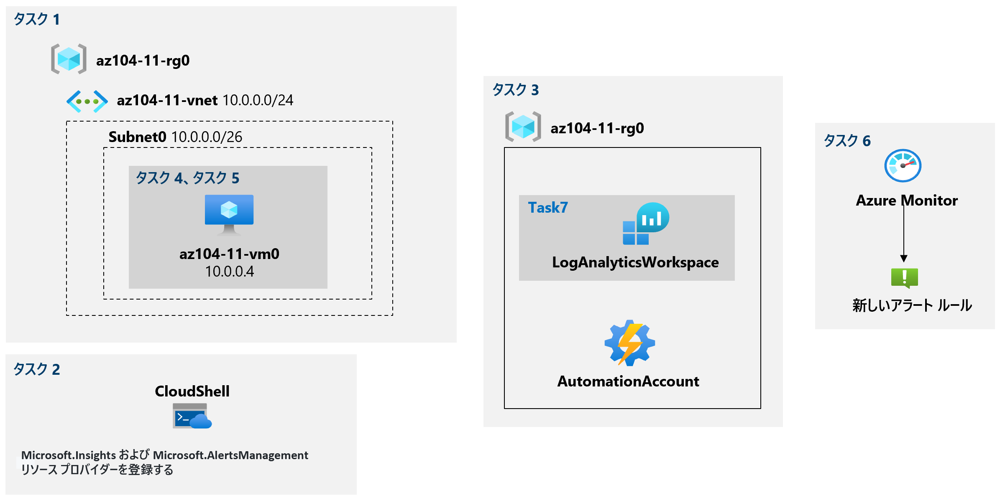

---
lab:
    title: '11 - モニタリングを実装する'
    module: 'モジュール 11 - モニタリング'
---

# ラボ 11 - モニタリングを実装する
# 学生用ラボ マニュアル

## ラボ シナリオ

Azure リソースのパフォーマンスと構成に関する分析情報を提供する Azure の機能を、特に 仮想マシンに焦点を当てて評価します。これを実現するために、ログ分析を含む Azure Monitor の機能を調べます。

## 目標

このラボでは次の内容を学習します。

+ タスク 1: ラボ環境をプロビジョニングする
+ タスク 2: Azure Log Analytics ワークスペースと Azure 自動化ベースのソリューションを作成して構成する
+ タスク 3: Azure 仮想マシンの既定の監視設定をレビューする
+ タスク 4: Azure 仮想マシンの診断設定を構成する
+ タスク 5: Azure Monitor の機能をレビューする
+ タスク 6: Azure ログ分析機能をレビューする

## 予想時間: 45 分

## アーキテクチャの図



## 手順

### 演習 1

#### タスク 1: ラボ環境をプロビジョニングする

このタスクでは、監視シナリオのテストに使用する仮想マシンを展開します。

1. [Azure portal](https://portal.azure.com) にサインインします。

1. Azure portal の右上にあるアイコンをクリックして **Azure Cloud Shell** を開きます。

1. **Bash** や **PowerShell** のどちらかを選択するためのプロンプトが表示されたら、**PowerShell** を選択します。

    >**注**: **Cloud Shell** の初回起動時に **「ストレージがマウントされていません」** というメッセージが表示された場合は、このラボで使用しているサブスクリプションを選択し、**「ストレージの作成」** を選択します。

1. Cloud Shell ウィンドウのツールバーで、**「ファイルのアップロード/ダウンロード」** アイコンをクリックし、ドロップダウン メニューで **「アップロード」** を選択して、ファイル **\\Allfiles\\Labs\\11\\az104-11-vm-template.json** および **\\Allfiles\\Labs\\11\\az104-11-vm-parameters.json** を Cloud Shell ホーム ディレクトリにアップロードします。

    >**注**: parameters ファイルの adminPassword の値を変更し、**独自パスワード** にすることができます。

1. Cloud Shell ウィンドウから次のコマンドを実行して、仮想マシンをホストするリソース グループを作成します。

    > **注**: **ワークスペース マッピングのドキュメント**で参照されている [Log Analytics ワークスペースリージョン](https://docs.microsoft.com/ja-jp/azure/automation/how-to/region-mappings)としてリストされているリージョンのいずれかを選択してください

   ```powershell
   $location = 'eastus'

   $rgName = 'az104-11-rg0'

   New-AzResourceGroup -Name $rgName -Location $location
   ```

1. 「Cloud Shell」 ウィンドウで、次のコマンドを実行して最初の仮想ネットワークを作成し、アップロードしたテンプレートとパラメーター ファイルを使用して仮想マシンをデプロイします。

   ```powershell
   New-AzResourceGroupDeployment `
      -ResourceGroupName $rgName `
      -TemplateFile $HOME/az104-11-vm-template.json `
      -TemplateParameterFile $HOME/az104-11-vm-parameters.json `
      -AsJob
   ```

    >**注**: デプロイが完了するのを待たずに、代わりに次のタスクに進みます。デプロイメント過程は約 3 分間かかる場合があります。

#### タスク 2: Microsoft.Insights および Microsoft.AlertsManagement リソース プロバイダーを登録します。

1. 「Cloud Shell」 ウィンドウから、次のコマンドを実行して、Microsoft.Insights および Microsoft.AlertsManagement リソース プロバイダーを登録します。

   ```powershell
   Register-AzResourceProvider -ProviderNamespace Microsoft.Insights

   Register-AzResourceProvider -ProviderNamespace Microsoft.AlertsManagement
   ```

1. 「Cloud Shell」 ウィンドウを最小化します (ただし、閉じないでください)。

#### タスク 3: Azure Log Analytics ワークスペースと Azure 自動化ベースのソリューションを作成して構成する

このタスクでは、Azure Log Analytics ワークスペースと Azure 自動化ベースのソリューションを作成して構成します。

1. Azure portal で、**「Log Analytics ワークスペース」** を検索して選択し、**「+ 作成」** をクリックします。

1. **「Log Analytics ワークスペースの作成」** ブレードの **「基本」** タブで、次の設定を行い、**「確認および作成」** をクリックし、**「作成」** をクリックします。

    | 設定 | 値 |
    | --- | --- |
    | サブスクリプション | このラボで使用する Azure サブスクリプションの名前 |
    | リソース グループ | 新しいリソース グループ **az104-11-rg1** の名前 |
    | Log Analytics ワークスペース | 一意な名前 |
    | リージョン | 前のタスクで仮想マシンをデプロイした Azure リージョンの名前 |

    >**注**: 前のタスクで仮想マシンをデプロイしたリージョンと同じリージョンを指定してください。

    >**注**: デプロイが完了するのを待ちます。デプロイメント過程は約 1 分間かかる場合があります。

1. Azure portalで、**「Automation アカウント」** を検索して選択し、**「+ 作成」** をクリックします。

1. **「Automation アカウントの追加」** ブレードに、次の設定を指定し、**「作成」** をクリックします。

    | 設定 | 値 |
    | --- | --- |
    | 名前 | 一意な名前 |
    | サブスクリプション | このラボで使用する Azure サブスクリプションの名前 |
    | リソース グループ | **az104-11-rg1** |
    | 場所 | [ワークスペース マッピングのドキュメント](https://docs.microsoft.com/ja-jp/azure/automation/how-to/region-mappings)に基づいて決定される Azure リージョンの名前 |


    > **注**: [ワークスペース マッピングのドキュメント](https://docs.microsoft.com/ja-jp/azure/automation/how-to/region-mappings)に基づいて Azure リージョンを指定していることを確認します。

    >**注**: デプロイが完了するのを待ちます。デプロイには約 3 分間かかります。

1. **「Automation アカウント」** ブレードで、**「更新」** をクリックし、新しく作成した Automation アカウントを表すエントリをクリックします。

1. 「Automation アカウント」 ブレードの **「構成管理」** セクションで、**「インベントリ」** をクリックします。

1. **「インベントリ」** ウィンドウの **「Log Analytics ワークスペース」** ドロップダウン リストで、このタスクで前に作成した 「Log Analytics ワークスペース」 を選択し、**「有効化」** をクリックします。

    >**注**: 対応する Log Analytics ソリューションのインストールが完了するまで待ちます。3 分間程度かかる場合があります。

    >**注**: これにより、**Change Tracking** ソリューションも自動的にインストールされます。

1. 「Automation アカウント」 が、この前のタスクで作成した 、「Automation アカウント」が選択されていることを確認します。

    >**注**: インストールが完了するまで待ちます。5 分間程度かかる場合があります。

#### タスク 4: Azure 仮想マシンの既定の監視設定をレビューする

このタスクでは、Azure 仮想マシンの既定の監視設定を確認します。

1. Azure portalで、**「Virtual Machines」** を検索して選択し、**「Virtual Machines」** ブレードで、**「az104-11-vm0」** を選択します 。

1. **「az104-11-vm0」** ブレードの **「監視」** セクションで、**「メトリック」** をクリックします。

1. **スコープ** には **az104-11-vm0** が自動的に選択されており既定のグラフでは、使用可能な **メトリック名前空間**は **仮想マシン ホスト**のみです。

    > **注**: ゲスト レベルの診断設定がまだ構成されていないので、これは正常な動作です。ただし、「**メトリック名前空間**」　ドロップダウン リストから直接ゲスト メモリ メトリックを有効にするオプションがあります。この演習の後半で有効にします。

1. **「メトリック」** ドロップダウン リストで、使用可能な指標のリストを確認します。

    >**注**: このリストには、ゲストレベルのメトリックにアクセスしなくても、仮想マシン ホストから収集できる、CPU、ディスク、およびネットワーク関連のメトリックの範囲が含まれています。

1. **「メトリック」** ドロップダウン リストで、**「Percentage CPU」** を選択し、**「集計」** ドロップダウン リストで **「平均」** を選択し、結果のグラフを確認します。 

#### タスク 5: Azure 仮想マシンの診断設定を構成する

このタスクでは、Azure 仮想マシンの診断設定を構成します。

1. **「az104-11-vm0」** ブレードの **「監視」** セクションで、**「診断設定」** をクリックします。

1. **「az104-11-vm0」** の **「診断設定」** ブレードで **診断ストレージアカウント** をドロップダウンリストから選択し、**「ゲスト レベルの監視を有効にする」** をクリックします。

    >**注**: 操作が有効になるまでお待ちください。3 分間程度かかる場合があります。

1. **「az104-11-vm0」** の **「パフォーマンス カウンター」** タブに切り替えます。使用可能なカウンターを確認します。

    >**注**: 既定では、CPU、メモリ、ディスク、およびネットワークの各カウンターが有効になっています。詳細な一覧については、**カスタム** ビューに切り替えることができます。

1. **「az104-11-vm0」** の **診断設定** で、**「ログ」** タブに切り替えます。使用可能なイベント ログの収集オプションを確認します。

    >**注**: 既定では、ログ収集には、アプリケーション ログおよびシステム ログからの重大、エラー、および警告のエントリと、セキュリティ ログからの監査エラー エントリが含まれます。ここでも、詳細な構成設定を行うために**カスタム**ビューに切り替えることができます。

1. **「az104-11-vm0」** ブレードの **「監視」** セクションで、**「ログ」** をクリックしてから **「有効」** をクリックします。

1. **「az104-11-vm0 - ログ」** ブレードで、このラボで前に作成した 「Log Analytics ワークスペースの選択」 ドロップダウン リストで **「Log Analytics ワークスペース」** が選択されていることを確認し、**「有効化」** をクリックします。

    >**注**: デプロイが完了するのを待たず、代わりに次の手順に進みます。操作には約 5 分間かかります。

1. **az104-11-vm0** の **「監視」** セクションで、**「メトリック」** をクリックします。

1. **「メトリック名前空間」** ドロップダウン リストに、**「仮想マシン ホスト」** エントリに加えて **ゲスト (クラシック)** エントリも含まれていることに注意してください。

    > **注**: これは、ゲスト レベルの診断設定を有効にしているためです。「**新しいゲスト メモリ メトリックを有効にする**」　オプションもあります。

1. 「**メトリック名前空間**」 ドロップダウン リストで、「**ゲスト (クラシック)**」 エントリを選択します。

1. **「メトリック」** ドロップダウン リストで、使用可能な指標のリストを確認します。

    >**注**: このリストには、ホストレベルの監視のみに依存する場合は利用できない追加のゲストレベルのメトリックが含まれています。

1. **「メトリック」** ドロップダウン リストで、**「\Memory\Available Bytes」** を選択し、**「集計」** ドロップダウン リストで **「最大値」** を選択して、結果のグラフを確認します。

#### タスク 6: Azure Monitor の機能をレビューする

1. Azure portal で、**モニター**を検索して選択し、**モニター**の **「概要」** ブレードで、**「メトリック」** をクリックします。

1. **「範囲の選択」** ブレードの **「参照」** タブで、**「スコープ」** より適切なサブスクリプションを選択し、**「スコープの絞り込み」** の **「リソースタイプ」** からドロップダウンより **「Virtual Machines」** を選択します。

1. **「選択されたスコープ」** に、**az104-11-rg0** リソース グループが表示されていることを確認し、**「適用」** をクリックします。

    >**注**: これにより、**「az104-11-vm0 - メトリック」** ブレードで使用できるビューとオプションと同じオプションが提供されます。

1. **「メトリック」** ドロップダウン リストで、**「Percentage CPU」** を選択し、**「集計」** ドロップダウン リストで **「平均」** を選択し、結果のグラフを確認します。

1. **「メトリック」** ブレードのウィンドウで、**「新しいアラート ルール」** をクリックします。

    > **注**: メトリックからのアラート ルールの作成は、ゲスト (クラシック) メトリック名前空間からのメトリックではサポートされていません。これは、[Windows 仮想マシンのリソース マネージャー テンプレートを使用して Azure Monitor メトリック ストアにゲスト OS メトリックを送信するドキュメントで説明されているように、Azure Resource Manager テンプレートを使用して実現できます。](https://docs.microsoft.com/ja-jp/azure/azure-monitor/platform/collect-custom-metrics-guestos-resource-manager-vm)

1. 「**シグナルの選択**」ブレードから、「**Percentage CPU**」を検索して選択します。

1. **「シグナル ロジックの構成」** ブレードのシグナルのリストの **「アラート ロジック」** セクションで、次の設定を指定し (他の設定は既定値のままにします)、**「完了」** をクリックします。

    | 設定 | 値 |
    | --- | --- |
    | しきい値 | **Static** |
    | 演算子 | **次の値より大きい** |
    | 集計タイプ | **平均** |
    | しきい値 | **2** |
    | 集約粒度 (期間) | **1 分** |
    | 評価の頻度 | **1 分ごと** |

1. **「アラート ルールの作成」** ブレードで **「次へ：アクション」** をクリックします。

1. 「**アクション グループの作成**」をクリックします。 ブレードの 「**基本**」 タブで、次の設定を指定し (他の設定は既定値のままにします)、「**次へ: 通知 >**」 を選択します。

    | 設定 | 値 |
    | --- | --- |
    | サブスクリプション | このラボで使用する Azure サブスクリプションの名前 |
    | リソース グループ | **az104-11-rg1** |
    | アクション グループ名:  | **az104-11-ag1** |
    | 表示名 | **az104-11-ag1** |

1. **「アクション グループの作成」** ブレードの **「通知」** タブ **「通知の種類」** ドロップダウン リストで、**「電子メール/SMS/プッシュ/音声」** を選択します。

1. **「電子メール/SMS/プッシュ/音声」** ブレードで、**「電子メール」** チェックボックスをオンにし、**「電子メール」** テキストボックスに自分のメール アドレスを入力し、他を既定値のままにして **「OK」** をクリックします。

1. **「名前」** テキストボックスで、**管理者へメール送信**を入力して、**「確認および作成」** をクリックします。

1. 「**アクション グループの作成**」 ブレードの 「**確認および作成**」 タブで、「**作成**」 をクリックします。

1. **「アラート ルールの作成」** ブレードで **「次へ：詳細」** をクリックし、 **「詳細」** セクションで、次の設定を指定します (他の設定は既定値のままにします)。

    | 設定 | 値 |
    | --- | --- |
    | アラートルール名 | **テストしきい値を超える CPU 割合** |
    | 説明 | **テストしきい値を超える CPU 割合** |
    | 重大度 | **重要度 3** |
    | 作成時に有効化 | **チェックON** (デフォルト）|

1. **「確認および作成」** をクリックし、**「作成」** をクリックします。

    >**注**: メトリック アラート ルールがアクティブになるには、最大 10 分間かかる場合があります。

1. Azure portalで、**「Virtual Machines」** を検索して選択し、**「Virtual Machines」** ブレードで、**「az104-11-vm0」** を選択します 。

1. **「az104-11-vm0」** ブレードで、**「接続」** をクリックし、ドロップダウン メニューで **「RDP」** をクリックし、**「RDP を使用して接続する」** ブレードで **「RDP ファイルのダウンロード」** をクリックし、プロンプトに従ってリモート デスクトップ セッションを開始します。

    >**注**: この手順では、Windows コンピューターからリモート デスクトップ経由で接続することを指します。Mac では、Mac App Store からリモート デスクトップ クライアントを使用でき、Linux コンピューターでは、オープンソースの RDP クライアント ソフトウェアを使用できます。

    >**注**: ターゲット仮想マシンに接続する際は、警告メッセージを無視できます。

1. プロンプトが表示されたら、**Student** のユーザー名と **Pa55w.rd1234** もしくは **独自パスワード** を使用してサインインします。

1. リモート デスクトップ セッション内で、**「スタート」** をクリックし、**「Windows System」** フォルダーを展開して、**「Command Prompt」** をクリックします。

1. コマンド プロンプトから次のコマンドを実行して、**az104-11-vm0** Azure VMの CPU 使用率の増加をトリガーします。

   ```sh
   for /l %a in (0,0,1) do echo a
   ```

    >**注**: これにより、新しく作成されたアラート ルールのしきい値を超える CPU 使用率を増加させる無限ループが開始されます。

1. リモート デスクトップ セッションを開いたままにして、ラボ コンピューターに Azure portal を表示するブラウザーの画面に戻ります。

1. Azure portal で、**「監視」** ブレードに戻り、**「警告」** をクリックします。

1. **3-情報** アラートの数をメモし、**3-情報** 行をクリックします。

    >**注**: 数分待ってから **「更新」** をクリックする必要がある場合があります。

1. **「すべてのアラート」** ブレードで、生成されたアラートを確認します。

#### タスク 7: Azure ログ分析機能をレビューする

1. Azure portal で、**「監視」** ブレードに戻り、**「ログ」** をクリックします。

    >**注**: 初めて Log Analytics にアクセスする場合は、**「有効」** をクリックする必要がある場合があります。その場合は、**「ワークスペースのサブスクリプション」** および **「Log Analytics ワークスペースの選択」** からタスク3で作成したワークスペースを選択します。

    >**注**: ログが表示されていない原因として、Log Analytics と仮想マシンが接続されていない場合があります。タスク3で作成したワークスペースから、「ワークスペースのデータソース」セクションの **仮想マシン** を選択して、該当する仮想マシンを接続します。

1. **「新しいクエリ１」** タブで、「**a104-11-vm0**」 が選択されていることを確認します。

    >**注**: 必要に応じて、「**スコープを選択する**」 をクリックして、「**選択の範囲**」 ブレードで、「**a104-11-vm0**」 を選択して、「**適用**」 をクリックします。

1. クエリ ウインドウで、次のクエリを貼り付けて、「**実行**」 をクリックして、結果のグラフを確認します。

   ```sh
   // Virtual Machine available memory
   // Chart the VM's available memory over the last hour.
   InsightsMetrics
   | where TimeGenerated > ago(1h)
   | where Name == "AvailableMB"
   | project TimeGenerated, Name, Val
   | render timechart
   ```
1. クエリ ウインドウで、先ほど張り付けたクエリを消去します。

1. 「**新しいクエリ１**」 の、「**クエリ**」タブで、「**その他**」を展開して「**Track VM availability**」 をクリックすると、クエリ ウィンドウに内容がコピーされます。「**実行**」 コマンド ボタンをクリックして、結果を確認します。

1. **「新しいクエリ 1」** タブの **「テーブル」** タブを選択して、**「Virtual machines」** セクションで、テーブルの一覧を確認します。

    >**注**: いくつかのテーブルの名前は、この実習ラボで先ほどインストールしたソリューションに対応しています。

1. **VM Computer** エントリの上にマウス を移動するとポップアップが表示されるので、**「プレビュー データを表示」** をクリックします。

1. データが使用可能な場合は、**VM Computer** ウィンドウで **「エディターで使用する」** をクリックすると、クエリウィンドウに選択したテーブルエントリが追記されます。実際には追記されたクエリテーブルに対してクエリを記述する必要があります。

    >**注**: 更新データが利用可能になるまで、数分待つ必要がある場合があります。

#### リソースをクリーン アップする

   >**注**: 新しく作成した Azure リソースのうち、使用しないリソースは必ず削除してください。使用しないリソースを削除しないと、予期しないコストが発生する場合があります。

1. Azure portal の **「Cloud Shell」** ウィンドウで **「PowerShell」** セッションを開きます。

1. 次のコマンドを実行して、このモジュールのラボ全体で作成したすべてのリソース グループのリストを表示します。

   ```powershell
   Get-AzResourceGroup -Name 'az104-11*'
   ```

1. 次のコマンドを実行して、このモジュールのラボ全体で作成したすべてのリソース グループのリストを削除します。

   ```powershell
   Get-AzResourceGroup -Name 'az104-11*' | Remove-AzResourceGroup -Force -AsJob
   ```

    >**注**: コマンドは非同期で実行されるので (-AsJob パラメーターによって決定されます)、別の PowerShell コマンドを同一 PowerShell セッション内ですぐに実行できますが、リソース グループが実際に削除されるまでに数分かかります。

#### レビュー

このラボでは次の内容を学習しました。

+ ラボ環境をプロビジョニングしました
+ Azure Log Analytics ワークスペースと Azure 自動化ベースのソリューションを作成して構成しました
+ Azure 仮想マシンの既定の監視設定をレビューしました
+ Azure 仮想マシンの診断設定を構成しました
+ Azure Monitor の機能をレビューしました
+ Azure Log Analytics の機能をレビューしました
